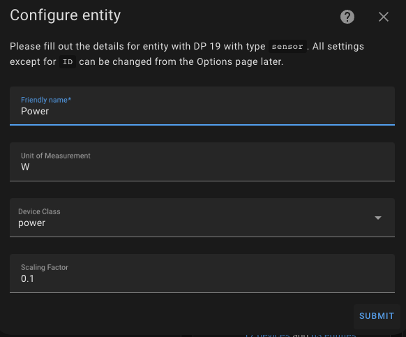

# Integrating TUYA WIFI Smart Circuit Breaker 1P 63A with HomeAssistant and LocalTuya

A short guide on how to integrate a [TUYA WIFI Smart Circuit Breaker 1P 63A](https://it.aliexpress.com/item/1005004323726897.html) in HomeAssisant using [LocalTuya](https://github.com/rospogrigio/localtuya).

The main issue I found using this switch with the traditional **Tuya** integration is that the switch exposes only two main controls, but no sensors about power consumption or anything else.   

  

Instead, I was interested in having all the power consumption measurements available, updated in real time, so that I could view them using gauges.

  

## LocalTuya configuration

As usual, I started using the [TuyaDebug](https://github.com/rospogrigio/localtuya/wiki/HOWTO-get-a-DPs-dump) tool to find out the *datapoints* used by the device, but I found out that the device does not send updates on value changes.

So, what I had to do, is to put a **1** in the *DPIDs to send in RESET command* field.

The complete device configuration is as follows:  

So, we can proceed to the **Settings** page, going to **Devices & Services**, searching the **LocalTuya** integration and clicking on **Configure**  

Then, select **Add a new device** and choose the device from the list ( 
Remeber, that you should assing a static ip address to the device).

Proceed with the settings as follows.  

### Adding the datapoints
Ater adding the device, you will be prompted to *"Please pick the type of entity you want to add."* for every datapoint to configure.  

Be careful to enter the correct type of platform and then fill in the various fields according to the images shown.

#### Current

#### Power

#### Voltage

